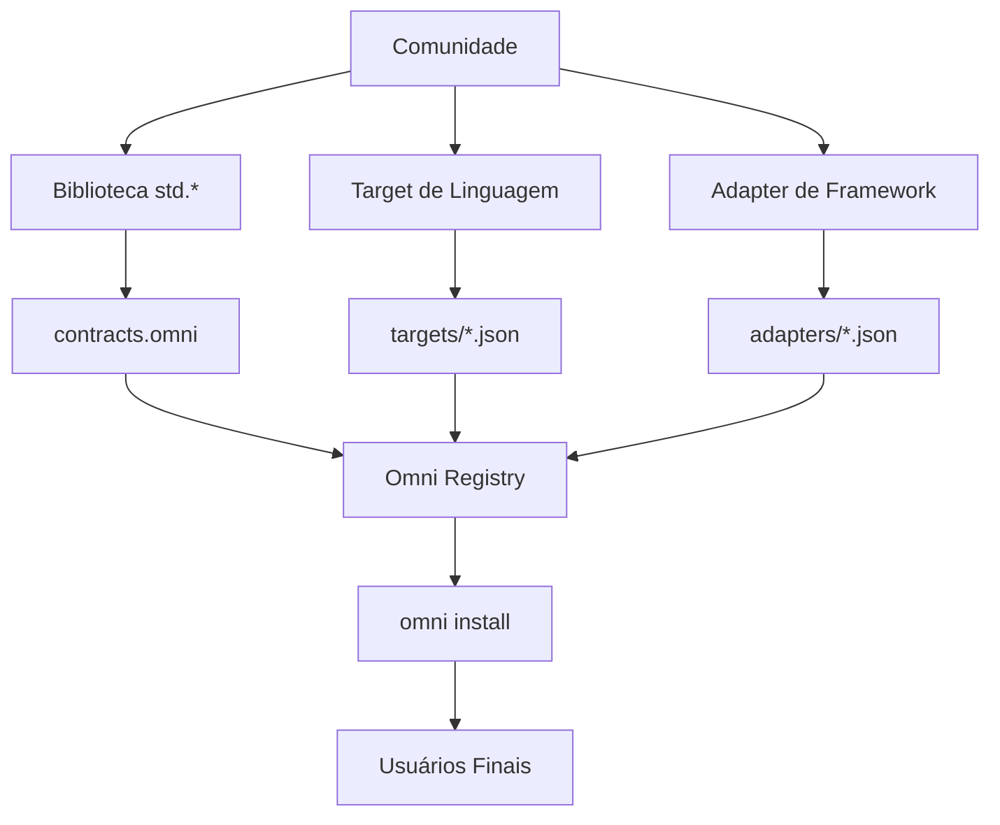

# Omni Community Expansion Guide

> **Qualquer um pode publicar um `.omni-pkg`. O ecossistema pertence à comunidade.**

---

## Visão Geral

O Omni foi projetado para crescer organicamente através de contribuições da comunidade. Existem três tipos principais de pacotes que você pode criar:



---

## 1. Criar uma Biblioteca (`std.*`)

Bibliotecas são contratos canônicos que definem interfaces abstratas implementadas por cada target.

### Passo a Passo

#### 1.1 Definir a Interface

Crie um arquivo com as assinaturas das funções:

```omni
// contracts/std_crypto_extended.omni

struct CanonicalInterface_crypto_extended {
    name: "std.crypto.extended",
    category: "crypto",
    version: "1.0.0",
    methods: {
        encrypt_aes: { signature: "fn encrypt_aes(data: string, key: string) -> string" },
        decrypt_aes: { signature: "fn decrypt_aes(data: string, key: string) -> string" },
        sign_rsa: { signature: "fn sign_rsa(data: string, private_key: string) -> string" },
        verify_rsa: { signature: "fn verify_rsa(data: string, signature: string, public_key: string) -> bool" }
    }
}
```

#### 1.2 Adicionar Implementações por Target

```json
// implementations.json
{
  "js": {
    "std.crypto.extended.encrypt_aes": "require('crypto').createCipheriv('aes-256-cbc', {1}, iv).update({0}, 'utf8', 'hex')",
    "std.crypto.extended.decrypt_aes": "require('crypto').createDecipheriv('aes-256-cbc', {1}, iv).update({0}, 'hex', 'utf8')"
  },
  "python": {
    "std.crypto.extended.encrypt_aes": "Cipher(algorithms.AES({1}), modes.CBC(iv)).encryptor().update({0})",
    "std.crypto.extended.decrypt_aes": "Cipher(algorithms.AES({1}), modes.CBC(iv)).decryptor().update({0})"
  },
  "c_native": {
    "std.crypto.extended.encrypt_aes": "openssl_aes_encrypt({0}, {1})",
    "std.crypto.extended.decrypt_aes": "openssl_aes_decrypt({0}, {1})"
  }
}
```

#### 1.3 Criar o Pacote

```
my-crypto-lib.omni-pkg/
├── manifest.json
├── contracts.omni
├── implementations.json
└── README.md
```

**manifest.json:**

```json
{
  "name": "crypto-extended",
  "version": "1.0.0",
  "type": "library",
  "author": "your-name",
  "description": "Extended cryptography functions for Omni",
  "contracts": ["std.crypto.extended"]
}
```

#### 1.4 Publicar

```bash
# Testar localmente
omni install ./my-crypto-lib.omni-pkg

# Publicar no registry (futuro)
omni publish ./my-crypto-lib.omni-pkg
```

---

## 2. Criar um Target de Linguagem

Targets definem como o código Omni é traduzido para uma linguagem específica.

### Passo a Passo

#### 2.1 Criar o Grammar JSON

```json
// targets/kotlin.json
{
  "name": "kotlin",
  "extension": ".kt",
  "description": "Kotlin/JVM target",

  "program_header": "// Generated by Omni Compiler\n\n",

  "templates": {
    "fn_decl": "fun {name}({params}): {return_type} {\n{body}\n}",
    "fn_decl_void": "fun {name}({params}) {\n{body}\n}",

    "let_decl": "val {name}: {type} = {value}",
    "var_decl": "var {name}: {type} = {value}",

    "if_stmt": "if ({condition}) {\n{consequence}\n}",
    "if_else_stmt": "if ({condition}) {\n{consequence}\n} else {\n{alternative}\n}",

    "while_stmt": "while ({condition}) {\n{body}\n}",
    "for_stmt": "for ({item} in {iterable}) {\n{body}\n}",

    "return_stmt": "return {value}",

    "struct_decl": "data class {name}(\n{fields}\n)",
    "struct_field": "    val {name}: {type}",

    "call_expr": "{callee}({args})",
    "member_access": "{object}.{member}",

    "string_literal": "\"{value}\"",
    "null": "null"
  },

  "type_map": {
    "i64": "Long",
    "i32": "Int",
    "f64": "Double",
    "string": "String",
    "bool": "Boolean",
    "void": "Unit",
    "any": "Any"
  },

  "operators": {
    "eq": "==",
    "neq": "!=",
    "and": "&&",
    "or": "||",
    "not": "!"
  }
}
```

#### 2.2 Adicionar Hooks de Runtime (Opcional)

Para linguagens de baixo nível (C, Assembly), adicione código de bootstrap:

```omni
// runtime/kotlin_runtime.omni
native "kotlin" {
    import java.io.File

    fun omni_read_file(path: String): String {
        return File(path).readText()
    }

    fun omni_write_file(path: String, content: String) {
        File(path).writeText(content)
    }
}
```

#### 2.3 Testar o Target

```bash
# Instalar
omni install targets/kotlin.json

# Compilar um arquivo de teste
omni compile test.omni output.kt --target kotlin

# Verificar o output
cat output.kt
```

#### 2.4 Hooks para ASM (Opcional)

Para máxima performance, injete Assembly inline:

```json
{
  "asm_hooks": {
    "simd_add": {
      "x86_64": "vmovaps ymm0, [{0}]\nvmovaps ymm1, [{1}]\nvaddps ymm0, ymm0, ymm1\nvmovaps [{2}], ymm0",
      "arm64": "ld1 {v0.4s}, [{0}]\nld1 {v1.4s}, [{1}]\nfadd v0.4s, v0.4s, v1.4s\nst1 {v0.4s}, [{2}]"
    }
  }
}
```

---

## 3. Criar um Adapter de Framework

Adapters mapeiam anotações Omni (`@ui`, `@server`, `@entity`) para estruturas de frameworks específicos.

### Passo a Passo

#### 3.1 Definir os Templates

```json
// adapters/svelte.json
{
  "name": "svelte",
  "version": "1.0.0",
  "type": "adapter",
  "language": "javascript",
  "description": "SvelteKit Framework Adapter",

  "ui_templates": {
    "page": "<script>\n{imports}\n{script}\n</script>\n\n{markup}\n\n<style>\n{styles}\n</style>",

    "component": "<script>\n    export let {props};\n</script>\n\n{markup}",

    "button": "<button on:click={{handler}}>{label}</button>",

    "list": "{#each {items} as item}\n    {renderItem}\n{/each}",

    "input": "<input bind:value={{name}} placeholder=\"{placeholder}\" />"
  },

  "server_templates": {
    "endpoint": "import type { RequestHandler } from './$types';\n\nexport const {method}: RequestHandler = async ({ params, request }) => {\n    {body}\n    return new Response(JSON.stringify(result));\n};",

    "load": "import type { PageLoad } from './$types';\n\nexport const load: PageLoad = async ({ params }) => {\n    {body}\n    return { {data} };\n};"
  },

  "structure": {
    "src/routes/": "Pages and endpoints",
    "src/lib/": "Shared components",
    "src/lib/server/": "Server-only code"
  },

  "file_patterns": {
    "@ui.page": "src/routes/{name}/+page.svelte",
    "@ui.component": "src/lib/{name}.svelte",
    "@server.get": "src/routes/api/{name}/+server.ts",
    "@server.post": "src/routes/api/{name}/+server.ts"
  }
}
```

#### 3.2 Mapear Anotações

| Anotação Omni               | Arquivo Gerado                     | Conteúdo        |
| --------------------------- | ---------------------------------- | --------------- |
| `@ui.page("home")`          | `src/routes/home/+page.svelte`     | Template Svelte |
| `@ui.component("Button")`   | `src/lib/Button.svelte`            | Componente      |
| `@server.get("/api/users")` | `src/routes/api/users/+server.ts`  | GET handler     |
| `@entity User`              | `prisma/schema.prisma` + migration | Model           |

#### 3.3 Empacotamento

```
svelte-adapter.omni-pkg/
├── manifest.json
├── adapter.json
├── templates/
│   ├── page.svelte.template
│   ├── component.svelte.template
│   └── endpoint.ts.template
└── README.md
```

---

## 4. Publicar no Omni Registry

### Estrutura do Registro

```
registry.omni-lang.org/
├── targets/
│   ├── kotlin.json
│   ├── swift.json
│   └── zig.json
├── adapters/
│   ├── svelte.json
│   ├── nuxt.json
│   └── flutter.json
└── libraries/
    ├── crypto-extended.omni-pkg
    └── http-advanced.omni-pkg
```

### Comando de Publicação (Futuro)

```bash
# Login
omni auth login

# Validar pacote
omni validate ./my-package.omni-pkg

# Publicar
omni publish ./my-package.omni-pkg

# Versionar
omni publish ./my-package.omni-pkg --version 1.1.0
```

---

## 5. Checklist de Contribuição

### Para Bibliotecas (`std.*`)

- [ ] Interface definida em formato canônico
- [ ] Implementações para JS, Python e C
- [ ] Testes unitários
- [ ] Documentação de uso

### Para Targets

- [ ] Todos os templates básicos (`fn_decl`, `let_decl`, `if_stmt`, `return_stmt`)
- [ ] Mapa de tipos completo
- [ ] Operadores mapeados
- [ ] Teste de compilação com código simples
- [ ] Runtime hooks (se necessário)

### Para Adapters

- [ ] Templates UI para componentes básicos
- [ ] Templates Server para endpoints
- [ ] Mapeamento de estrutura de pastas
- [ ] Teste de geração de projeto completo

---

## 6. Regra de Ouro da Comunidade

> **"A lógica Omni é o centro de gravidade.** > **A forma de edição (Visual ou Texto) e o ambiente de execução (App, Web ou Terminal) são apenas camadas intercambiáveis."**

O ecossistema Omni cresce quando cada contribuidor adiciona sua peça ao quebra-cabeça universal. Seu target Kotlin, seu adapter Svelte, sua biblioteca de criptografia — todos se encaixam no mesmo sistema, permitindo que desenvolvedores em qualquer lugar do mundo escrevam lógica uma vez e a executem em qualquer lugar.

**Bem-vindo à comunidade Omni.** 🌍
