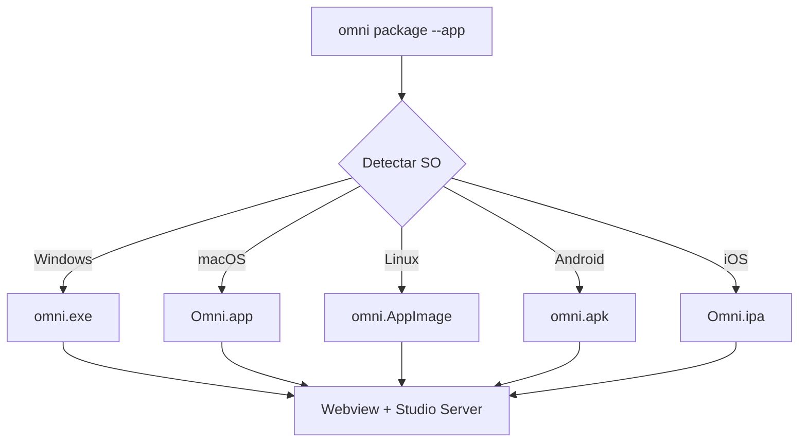
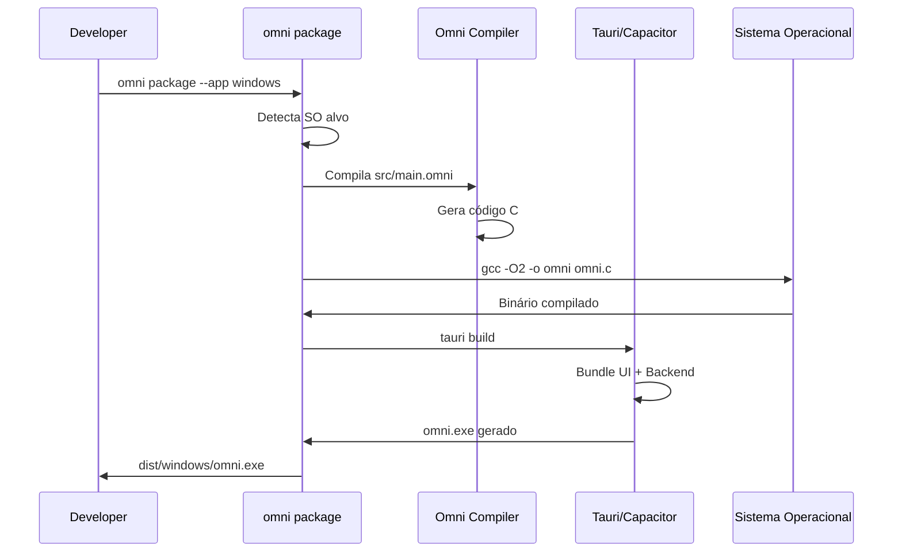

# Omni Studio Native Distribution

> **Um binário. Qualquer plataforma. Zero dependências.**

---

## Visão Geral

O Omni Studio pode ser distribuído como um aplicativo nativo que não requer Node.js, Python ou qualquer runtime externo. Isso é possível através de duas estratégias:

1. **Tauri Webview** - Para desktop (Windows, macOS, Linux)
2. **Capacitor** - Para mobile (Android, iOS)



---

## Arquitetura Nativa

### Componentes

```
┌─────────────────────────────────────────────────────────────────┐
│                      OMNI NATIVE APP                            │
├─────────────────────────────────────────────────────────────────┤
│                                                                 │
│  ┌─────────────────────────────────────────────────────────────┐│
│  │                    WEBVIEW LAYER                            ││
│  │  • Renderiza a UI do Studio (HTML/CSS/JS)                   ││
│  │  • Tauri (Desktop) ou Capacitor (Mobile)                    ││
│  └─────────────────────────────────────────────────────────────┘│
│                              │                                  │
│                              │ IPC                              │
│                              ▼                                  │
│  ┌─────────────────────────────────────────────────────────────┐│
│  │                    STUDIO ENGINE                            ││
│  │  • Servidor HTTP embutido                                   ││
│  │  • Cross-Runner (executa comandos)                          ││
│  │  • Compilador Omni                                          ││
│  └─────────────────────────────────────────────────────────────┘│
│                              │                                  │
│                              │ Native APIs                      │
│                              ▼                                  │
│  ┌─────────────────────────────────────────────────────────────┐│
│  │                    OMNI RUNTIME                             ││
│  │  • Arena Allocator                                          ││
│  │  • std.fs / std.io / std.http                              ││
│  │  • Bindings nativos do SO                                   ││
│  └─────────────────────────────────────────────────────────────┘│
│                                                                 │
└─────────────────────────────────────────────────────────────────┘
```

---

## Empacotamento para Desktop

### Windows (.exe)

```bash
omni package --app windows
```

**Processo:**

1. Compila `src/main.omni` para C nativo
2. Gera o runtime header (`omni_runtime.h`)
3. Compila com MinGW ou MSVC
4. Empacota com Tauri para criar `.msi` ou `.exe` portátil

**Estrutura do Output:**

```
dist/windows/
├── omni.exe           # Executável principal
├── resources/
│   └── studio/        # Arquivos da UI
└── omni.msi           # Instalador (opcional)
```

### macOS (.app)

```bash
omni package --app macos
```

**Processo:**

1. Compila com Clang
2. Cria bundle `.app` com Tauri
3. Code signing (requer Apple Developer ID)

### Linux (.AppImage)

```bash
omni package --app linux
```

**Processo:**

1. Compila com GCC
2. Empacota como AppImage (universal)
3. Ou cria `.deb` / `.rpm` específicos

---

## Empacotamento para Mobile

### Android (.apk)

```bash
omni package --app android
```

**Processo:**

1. Gera projeto Capacitor
2. Copia Studio UI para `www/`
3. Compila com Android SDK
4. Gera APK assinado

**Requisitos:**

- Android SDK
- Java JDK 11+
- Gradle

### iOS (.ipa)

```bash
omni package --app ios
```

**Processo:**

1. Gera projeto Capacitor
2. Abre no Xcode
3. Compila com perfil de provisionamento
4. Gera IPA

**Requisitos:**

- macOS
- Xcode
- Apple Developer Account

---

## Integração Webview ↔ Studio

### Comunicação IPC

A UI (Webview) comunica com o Engine (nativo) via IPC:

```javascript
// Frontend (UI)
window.__OMNI__.invoke('run_command', {
    cmd: 'omni run app.omni'
}).then(result => {
    console.log(result);
});

// Backend (Engine)
#[tauri::command]
fn run_command(cmd: &str) -> Result<String, String> {
    let output = Command::new("sh")
        .arg("-c")
        .arg(cmd)
        .output()?;
    Ok(String::from_utf8_lossy(&output.stdout).to_string())
}
```

### APIs Expostas

| API                                     | Descrição                   |
| --------------------------------------- | --------------------------- |
| `invoke('run_command', {cmd})`          | Executa comando no terminal |
| `invoke('read_file', {path})`           | Lê arquivo do sistema       |
| `invoke('write_file', {path, content})` | Escreve arquivo             |
| `invoke('list_dir', {path})`            | Lista diretório             |
| `invoke('compile', {source, target})`   | Compila código Omni         |
| `invoke('get_graph', {file})`           | Retorna grafo visual        |

---

## Tauri Configuration

```json
// tauri.conf.json
{
  "build": {
    "distDir": "../dist/studio",
    "devPath": "http://localhost:3000"
  },
  "package": {
    "productName": "Omni Studio",
    "version": "1.0.0"
  },
  "tauri": {
    "bundle": {
      "active": true,
      "icon": ["icons/icon.png"],
      "identifier": "org.omni.studio",
      "targets": ["msi", "app", "appimage"]
    },
    "windows": [
      {
        "title": "Omni Studio",
        "width": 1280,
        "height": 800,
        "minWidth": 800,
        "minHeight": 600,
        "resizable": true,
        "fullscreen": false
      }
    ],
    "allowlist": {
      "shell": { "execute": true },
      "fs": { "all": true },
      "path": { "all": true },
      "process": { "all": true }
    }
  }
}
```

---

## Fluxo de Build Completo



---

## Checklist de Distribuição

### Desktop

- [ ] Binário compilado para SO alvo
- [ ] UI do Studio empacotada
- [ ] Assinatura de código (Windows/macOS)
- [ ] Instalador gerado

### Mobile

- [ ] Projeto Capacitor configurado
- [ ] Ícones e splash screens
- [ ] Permissões declaradas
- [ ] APK/IPA assinado

---

## Vantagens da Distribuição Nativa

| Aspecto       | Com Node.js       | Nativo            |
| ------------- | ----------------- | ----------------- |
| Tamanho       | ~150MB            | ~15MB             |
| Startup       | 2-3s              | <100ms            |
| Dependências  | Node.js runtime   | Nenhuma           |
| Portabilidade | Requer instalação | Copiar e executar |
| Performance   | Interpretado      | Código nativo     |

---

## Regra de Ouro

> **"O Omni Studio deve abrir instantaneamente, em qualquer máquina, sem perguntar nada."**

O objetivo é que o desenvolvedor baixe um único arquivo, execute, e comece a programar. Sem instaladores, sem runtimes, sem configuração.

_Isso é o Omni Native._
