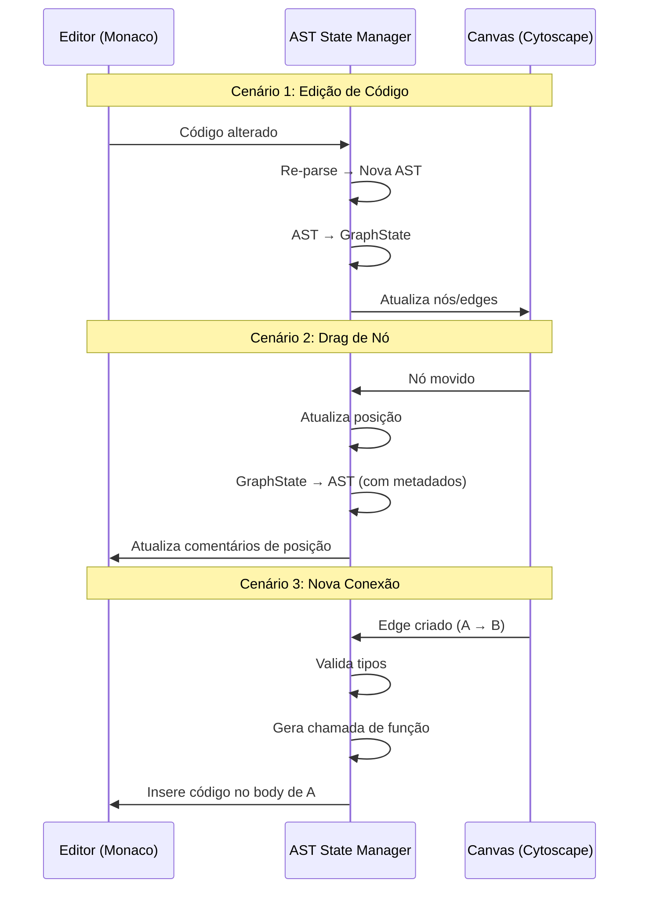
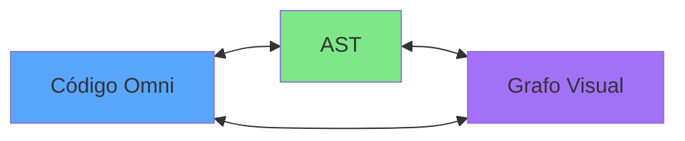

# Visual Programming in Omni

> **Da Caixa ao Código: Programação por fluxos com paridade 100%.**

---

## Conceito Central

A programação visual no Omni não é uma "alternativa" ao código — é uma **representação isomórfica** da mesma AST. Cada nó é uma função, cada conexão é uma chamada ou passagem de dados. O que você desenha no grafo é exatamente o que está no arquivo `.omni`.

---

## Elementos Visuais

### 1. Nós (Nodes)

| Tipo         | Forma                     | Exemplo                                 |
| ------------ | ------------------------- | --------------------------------------- |
| **Função**   | Retângulo                 | `fn getUserById(id) -> User`            |
| **Cápsula**  | Retângulo duplo           | `capsule UserService { ... }`           |
| **Entidade** | Retângulo com borda dupla | `@entity struct User { ... }`           |
| **Fluxo**    | Hexágono                  | `@server.get("/api/users") flow list()` |
| **Condição** | Diamante                  | `if (user.active) { ... }`              |
| **Loop**     | Paralelogramo             | `while (running) { ... }`               |

### 2. Conectores (Edges)

| Tipo                  | Estilo               | Significado          |
| --------------------- | -------------------- | -------------------- |
| **Fluxo de Execução** | Linha sólida →       | Ordem de execução    |
| **Passagem de Dados** | Linha tracejada ⤍    | Argumento ou retorno |
| **Dependência**       | Linha pontilhada ··· | Import ou uso        |

### 3. Portas (Ports)

Cada nó tem portas de entrada (parâmetros) e saída (retorno):

```
         ┌─────────────────────────┐
 id  ────┤  getUserById            ├───── User
         │  @server.get("/api/:id")│
         └─────────────────────────┘
```

---

## Mapeamento AST → Grafo

### Estrutura de Dados do Nó

```json
{
  "id": "node_123",
  "type": "flow",
  "name": "getUserById",
  "position": { "x": 100, "y": 200 },
  "ports": {
    "inputs": [{ "id": "port_1", "name": "id", "type": "i64" }],
    "outputs": [{ "id": "port_2", "name": "return", "type": "User" }]
  },
  "attributes": [{ "name": "server.get", "args": ["/api/users/:id"] }],
  "ast_ref": {
    "kind": 4,
    "line": 25,
    "column": 1
  }
}
```

### Estrutura de Dados da Conexão

```json
{
  "id": "edge_456",
  "source": { "node": "node_123", "port": "port_2" },
  "target": { "node": "node_789", "port": "port_1" },
  "type": "data"
}
```

---

## Fluxo de Trabalho

### 1. Código → Grafo

```bash
omni graph app.omni --json graph.json
```

O Ghost Writer analisa a AST e gera:

1. Lista de nós (funções, cápsulas, entidades)
2. Lista de conexões (chamadas, dependências)
3. Metadados de posicionamento (auto-layout)

### 2. Grafo → Código

```bash
omni codegen graph.json app.omni
```

O Studio Engine percorre o grafo e gera código Omni equivalente, preservando:

- Ordem de execução
- Nomes de funções
- Tipos de parâmetros
- Atributos (decorators)

---

## Biblioteca de Nós

### Nós Padrão (Built-in)

| Categoria        | Nós                               |
| ---------------- | --------------------------------- |
| **Control Flow** | If, While, For, Match             |
| **Data**         | Let, Const, Return                |
| **I/O**          | Print, Input, ReadFile, WriteFile |
| **HTTP**         | Get, Post, Put, Delete            |
| **Database**     | Query, Execute, Connect           |

### Nós da Comunidade

Qualquer pacote instalado via `omni install` pode adicionar nós personalizados:

```bash
omni install stripe-adapter.omni-pkg

# Novos nós disponíveis:
# - Stripe.createPayment
# - Stripe.getCustomer
# - Stripe.refund
```

---

## Auto-Layout

O Studio usa o algoritmo **Dagre** para posicionar automaticamente os nós baseado em:

1. **Hierarquia de chamadas** - Funções chamadoras acima
2. **Fluxo de dados** - Esquerda para direita
3. **Agrupamento** - Cápsulas são subgrafos

```
Level 0: [main] [handleRequest]
           │         │
           ▼         ▼
Level 1: [UserService] [AuthService]
           │         │
           ▼         ▼
Level 2: [UserDB]  [TokenStore]
```

---

## Validação em Tempo Real

O Studio valida o grafo continuamente:

| Erro               | Indicador        |
| ------------------ | ---------------- |
| Tipo incompatível  | Conexão vermelha |
| Parâmetro faltando | Porta piscando   |
| Ciclo infinito     | Borda destacada  |
| Nome duplicado     | Nó com alerta    |

---

## Exportação

O grafo pode ser exportado para:

1. **Código Omni** (`.omni`) — Padrão
2. **Mermaid** (`.md`) — Documentação
3. **JSON** (`.json`) — Intercâmbio
4. **PNG/SVG** — Imagem estática

---

## Exemplo Completo

### Código Omni

```omni
@entity
struct User {
    id: i64,
    name: string
}

capsule UserService {
    @server.get("/api/users/:id")
    flow getUser(id: i64) -> User {
        let user = Database.query("SELECT * FROM users WHERE id = ?", [id]);
        return user;
    }
}
```

### Representação Visual

```
┌──────────────────────────────────────────────────────────────────┐
│                        UserService                               │
│  ┌──────────────────────────────────────────────────────────────┐│
│  │                                                              ││
│  │   ┌─────────────────┐                                        ││
│  │   │    getUser      │                                        ││
│  │   │ GET /api/:id    │                                        ││
│  │   └────────┬────────┘                                        ││
│  │            │ id                                              ││
│  │            ▼                                                 ││
│  │   ┌─────────────────┐                                        ││
│  │   │ Database.query  │                                        ││
│  │   └────────┬────────┘                                        ││
│  │            │ user                                            ││
│  │            ▼                                                 ││
│  │   ┌─────────────────┐                                        ││
│  │   │     return      │───────► User                           ││
│  │   └─────────────────┘                                        ││
│  │                                                              ││
│  └──────────────────────────────────────────────────────────────┘│
└──────────────────────────────────────────────────────────────────┘

┌─────────────────┐
│     User        │
│ @entity         │
├─────────────────┤
│ id: i64         │
│ name: string    │
└─────────────────┘
```

---

## Mapeamento Semântico Detalhado

### Cápsula = Grupo de Nós

Uma cápsula no código se torna um **subgrafo** no visual:

```omni
capsule UserService {
    flow list() -> User[]
    flow create(data: User) -> User
}
```

```mermaid
graph TD
    subgraph UserService
        list[list] --> User_List[User[]]
        create[create] --> User_Single[User]
    end
```

### Flow = Nó de Processamento

Um flow é um nó com atributos decoradores visíveis:

```omni
@server.get("/api/users")
flow getUsers() -> User[] {
    return Database.findAll("users");
}
```

Representação visual:

```
┌─────────────────────────────────┐
│  ⬡ getUsers                     │
│  └─ @server.get("/api/users")   │
├─────────────────────────────────┤
│  → return: User[]               │
└─────────────────────────────────┘
```

### Let = Nó de Dado

Declarações de variáveis aparecem como nós de dado:

```omni
let userId = 42;
let userName = "John";
```

```
[42] ──→ [userId: i64]
["John"] ──→ [userName: string]
```

---

## Sincronização Bidirecional em Tempo Real

O Studio mantém uma conexão WebSocket entre o Editor (código) e o Canvas (grafo). Qualquer alteração em um é refletida no outro instantaneamente.

### Diagrama de Sincronização



### Eventos de Sincronização

| Evento no Editor        | Ação no Canvas            |
| ----------------------- | ------------------------- |
| Nova função             | Novo nó criado            |
| Renomear função         | Nome do nó atualizado     |
| Adicionar parâmetro     | Nova porta de entrada     |
| Deletar função          | Nó removido + edges       |
| Alterar tipo de retorno | Porta de saída atualizada |

| Evento no Canvas | Ação no Editor            |
| ---------------- | ------------------------- |
| Arrastar nó      | (nenhum - apenas visual)  |
| Criar conexão    | Inserir chamada de função |
| Deletar nó       | Remover função do código  |
| Renomear nó      | Renomear função           |
| Alterar atributo | Atualizar decorator       |

### Persistência de Posição

Posições dos nós são salvas como comentários especiais no código:

```omni
// @visual:position(100, 200)
fn getUserById(id: i64) -> User {
    return Database.findById(id);
}
```

Isso permite que o layout visual seja preservado entre sessões sem poluir a AST.

---

## Regra de Ouro

> **O grafo é a AST. A AST é o código. O código é o grafo.** > **Qualquer alteração em um é refletida nos outros instantaneamente.** > **Não há tradução. Apenas representação.**



_Desenhe seu código. Compile seu grafo. Execute sua visão._
